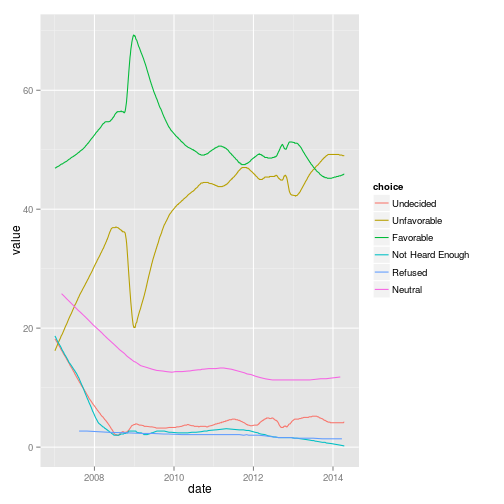

[](https://travis-ci.org/jrnold/pollster)


# R interface to the Huffpost Pollster API

This R package is an interface to the Huffington Post [Pollster API](http://elections.huffingtonpost.com/pollster/api), which provides access to opinion polls collected by the Huffington Post.

# Install

This package is not *yet* on CRAN.

You can install this with the function ``install_github`` in the **devtools** package.

```r
install.packages("devools")
library("devtools")
install_github("jrnold/pollster")
```


```r
library("pollster")
```


# Examples

## Charts

To get a list of all the charts in the API use the function ``pollster_charts``,

```r
charts <- pollster_charts()
```

```
## Error: arguments imply differing number of rows: 1, 0
```

```r
str(charts)
```

```
## Error: object 'charts' not found
```

This returns a ``list`` with two data frames.
The data frame ``charts`` has data on each chart,
while the data frame ``estimates`` has the current poll-tracking estimates from each chart.

The query can be filtered by state or topic.
For example, to get only charts related to national topics,

```r
us_charts <- pollster_charts(state = "US")
```

```
## Error: arguments imply differing number of rows: 1, 0
```


## Chart

To get a particular chart use the function ``pollster_chart``.
For example, to get the chart for [Barack Obama's Favorable Rating](http://elections.huffingtonpost.com/pollster/obama-favorable-rating), specify its *slug*, ``obama-favorable-rating``.

```r
obama_favorable <- pollster_chart("obama-favorable-rating")
str(obama_favorable)
```

```
## List of 11
##  $ title            : chr "Barack Obama Favorable Rating"
##  $ slug             : chr "obama-favorable-rating"
##  $ topic            : chr "favorable-ratings"
##  $ state            : chr "US"
##  $ short_title      : chr "Obama Favorability"
##  $ election_date    : NULL
##  $ poll_count       : num 803
##  $ last_updated     : POSIXct[1:1], format: "2014-04-17 15:48:01"
##  $ url              : chr "http://elections.huffingtonpost.com/pollster/obama-favorable-rating"
##  $ estimates        :'data.frame':	4 obs. of  7 variables:
##   ..$ choice         : Factor w/ 4 levels "Favorable","Unfavorable",..: 1 2 3 4
##   ..$ value          : num [1:4] 45.9 49 4.2 0.2
##   ..$ lead_confidence: logi [1:4] NA NA NA NA
##   ..$ first_name     : logi [1:4] NA NA NA NA
##   ..$ last_name      : logi [1:4] NA NA NA NA
##   ..$ party          : logi [1:4] NA NA NA NA
##   ..$ incumbent      : logi [1:4] NA NA NA NA
##  $ estimates_by_date:'data.frame':	2120 obs. of  3 variables:
##   ..$ choice: Factor w/ 6 levels "Undecided","Unfavorable",..: 1 2 3 4 1 2 3 1 2 3 ...
##   ..$ value : num [1:2120] 4.2 49 45.9 0.2 4.2 49 45.9 4.2 49 45.9 ...
##   ..$ date  : Date[1:2120], format: "2014-04-15" ...
```

The slug can be found from the results of a ``pollster_charts`` query.
Alternatively the slug is the path of the url of a chart, http://elections.huffingtonpost.com/pollster/obama-favorable-rating.

The historical estimates of the Huffpost Pollster poll-tracking model are contained in the element ``"estimates_by_date"``,

```r
(ggplot(obama_favorable[["estimates_by_date"]], aes(x = date, y = value, color = choice)) + 
    geom_line())
```

 


## Polls

To get the opinion poll results use the function ``pollster_polls`.
The polls returned can be filtered by topic, chart, state, or date.

By default, ``pollster_polls`` only returns 1 page of results (about 10 polls).
To have it return more polls, increase the value of ``max_pages``.
To have it return all polls, set the value of ``max_pages`` to a very high number.
For example, to return all the polls on the favorability of Bararck Obama after March 1, 2014,

```r
obama_favorable_polls <- pollster_polls(max_pages = 10000, chart = "obama-favorable-rating", 
    after = "2014-3-1")
str(obama_favorable_polls)
```

```
## List of 2
##  $ polls    :'data.frame':	14 obs. of  9 variables:
##   ..$ id           : num [1:14] 19256 19261 19252 19239 19169 ...
##   ..$ pollster     : Factor w/ 8 levels "FOX","YouGov/Economist",..: 1 2 3 2 2 2 4 5 6 2 ...
##   ..$ start_date   : Date[1:14], format: "2014-04-13" ...
##   ..$ end_date     : Date[1:14], format: "2014-04-15" ...
##   ..$ method       : Factor w/ 2 levels "Phone","Internet": 1 2 1 2 2 2 2 1 1 2 ...
##   ..$ source       : Factor w/ 14 levels "http://www.foxnews.com/politics/interactive/2014/04/21/fox-news-poll-independents-more-likely-to-back-anti-obamacare-candidates"| __truncated__,..: 1 2 3 4 5 6 7 8 9 10 ...
##   ..$ last_updated : POSIXct[1:14], format: "2014-04-22 15:42:58" ...
##   ..$ survey_houses: chr [1:14] "" "" "" "" ...
##   ..$ sponsors     : chr [1:14] "" "" "" "" ...
##  $ questions:'data.frame':	882 obs. of  14 variables:
##   ..$ question       : Factor w/ 32 levels "2014 National House Race",..: 1 1 1 1 2 2 2 2 2 2 ...
##   ..$ chart          : chr [1:882] "2014-national-house-race" "2014-national-house-race" "2014-national-house-race" "2014-national-house-race" ...
##   ..$ topic          : chr [1:882] "2014-house" "2014-house" "2014-house" "2014-house" ...
##   ..$ state          : chr [1:882] "US" "US" "US" "US" ...
##   ..$ subpopulation  : Factor w/ 12 levels "Registered Voters",..: 1 1 1 1 1 1 1 2 2 2 ...
##   ..$ observations   : num [1:882] 1012 1012 1012 1012 1012 ...
##   ..$ margin_of_error: num [1:882] 3 3 3 3 3 3 3 5 5 5 ...
##   ..$ choice         : Factor w/ 77 levels "Democrat","Republican",..: 1 2 3 4 5 6 4 5 6 4 ...
##   ..$ value          : num [1:882] 41 44 3 13 42 51 6 80 13 7 ...
##   ..$ first_name     : chr [1:882] NA NA NA NA ...
##   ..$ last_name      : chr [1:882] NA NA NA NA ...
##   ..$ party          : chr [1:882] "Dem" "Rep" NA NA ...
##   ..$ incumbent      : logi [1:882] FALSE FALSE NA NA NA NA ...
##   ..$ id             : num [1:882] 19256 19256 19256 19256 19256 ...
```


# Misc

Also see an earlier R interface by [Drew Linzer](https://github.com/dlinzer/pollstR/).

<!--  LocalWords:  Huffpost API Huffington CRAN github devtools str
 -->
<!--  LocalWords:  devools jrnold ggplot obama url aes favorability
 -->
<!--  LocalWords:  Bararck
 -->
<!-- -->
