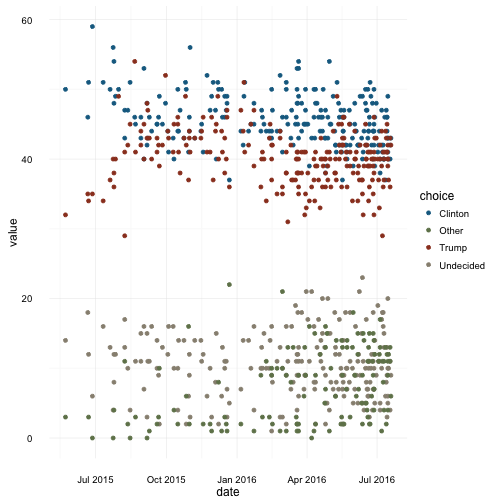
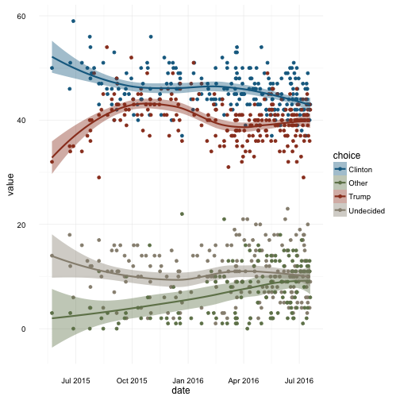
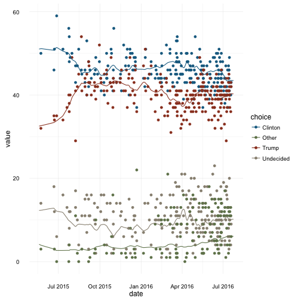

[](http://cran.r-project.org/package=pollstR)

[](https://travis-ci.org/rOpenGov/pollstR)

# pollstR: An R Client for the HuffPost Pollster API


This R package is an interface to the Huffington Post [Pollster API](http://elections.huffingtonpost.com/pollster/api), which provides access to opinion polls collected by the Huffington Post.  

This package is part of the [ROpenGov](http://ropengov.github.io/) project.


# Install

You can install the stable version on [CRAN](http://cran.r-project.org/package=pollstR):

```r
install.packages('pollstR', dependencies = TRUE)
```

To install the very latest version, since the CRAN version use **devtools**,

```r
library("devtools")
install_github("rOpenGov/pollstR")
```


# Errors

If you encounter an error when using one of the functions it is likely that there was an error in converting the data as returned by the API into data structures more usable in R.
This may happen when the Huffpost Pollster API changes, and **pollstR** has not been updated yet.
So if you encounter an error,

1. Install the latest version of **pollstR** from github and see if the bug has been fixed.
2. Try running the function with `convert = FALSE`, this will return the data as returned by the API without any of the conversions to more 
    R friendly data frames. If there is no error, then it is problem with the conversion code in this package.
    In the short term, you can `convert = FALSE`, to get the data from the API until the bug is fixed.
3. Open a new issue on [github](https://github.com/rOpenGov/pollstR/issues)


# API Overview

The Pollster API has two primary data structures: charts and polls.

*Polls* are individual, dated topline results for a single set of candidates in a single race.
The poll data structure consists of (generally) named candidates and percentage support for each, along with additional information (e.g., polling house, sampling frame, sample size, margin of error, state, etc.).

*Charts* aggregate polls for a particular race or topic (e.g., "2012-president" or "obama-job-approval".
A chart reports aggregated survey estimates of support for the candidates in a given race and, possibly, daily estimates of support.
Each chart is named, reports the number of aggregated polls it presents, a last-updated date, and a "slug" field. The "slug" identifies the chart both in the API and on the Pollster website.

See the [Huffpost Pollster API](http://elections.huffingtonpost.com/pollster/api) for the full description and documentation of the API.

The **pollstR** package has four main functions:

- `pollster_charts`: Information about all charts available. [API](http://elections.huffingtonpost.com/pollster/api#charts)
- `pollster_chart`:  Data on an individual chart, including the estimates by date. It does not include the poll data used to construct
    those estimates. See `pollster_chart_data` for that. [API](http://elections.huffingtonpost.com/pollster/api#chart)
- `pollster_chart_data`: The polls used in a chart. [API](http://elections.huffingtonpost.com/pollster/api#chart-csv)
- `pollster_polls`: Query and retrieve all polls available through the Pollster API. [API](http://elections.huffingtonpost.com/pollster/api#polls)

These **pollstR** functions have two main purposes: create the url to retrieve data, and 
more importantly, convert the results returned by the API to into data structures more amenable to
analysis in R. The API results are usually trees; the **pollstR** functions converts them 
into data frames or lists of tidy data frames.


# Example Chart: 2016 General Election, Trump v. Clinton

You can use **pollstR** and **ggplot2** to creates charts similar to those the Huffpost Pollster website.
The Huffpost Pollster combines polls with similar questions into "charts".
This is the current Huffpost Pollster chart for the [2016 General Election: Clinton vs. Trump](http://elections.huffingtonpost.com/pollster/2016-general-election-trump-vs-clinton).

<script src="http://elections.huffingtonpost.com/pollster/2016-general-election-trump-vs-clinton/embed.js"></script>

We will create a similar chart using R with date up to 2016-08-23, when this vignette was built.
This example will use the following packages,

```r
library("ggplot2")
library("dplyr")
library("tidyr")
```

The first thing to do is find the slug for the chart of interest, which we will need to pull data from the API.
The slug 2016 General Election results chart is `2016-general-election-trump-vs-clinton`.
In general, the chart slug the last segment of the chart's URL: `http://elections.huffingtonpost.com/pollster/2016-general-election-trump-vs-clinton`.

```r
slug <- "2016-general-election-trump-vs-clinton"
```

We will need two things for this plot: the poll results, and Pollster's smoothed estimates which aggregate the polls.
To get the polls associated with a specific chart, we use `pollster_chart_tbl()`. 
While the `pollster_polls()` function returns polls, and has a `chart` argument, it is now deprecated and unreliable, 
When a poll had questions associated with multiple charts, the API would randomly assign a chart value.
However, the `chart_tbl()` function correctly returns the poll data in a Pollster chart (see the [API docs](http://elections.huffingtonpost.com/pollster/api#chart-csv)).

```r
elec_2016_polls <- pollster_chart_data(slug)
```


```r
glimpse(elec_2016_polls)
```

```
## Observations: 234
## Variables: 13
## $ Clinton              <dbl> 43, 40, 42, 43, 40, 46, 43, 41, 49, 44, 4...
## $ Trump                <dbl> 42, 36, 43, 40, 37, 45, 40, 39, 42, 41, 4...
## $ Undecided            <dbl> 9, 11, 4, 6, 10, 9, 10, 20, 5, 3, 13, 8, ...
## $ Other                <dbl> 6, 13, 11, 11, 12, NA, 9, NA, 4, 12, NA, ...
## $ poll_id              <int> 24947, 24949, 24946, 24934, 24925, 24929,...
## $ pollster             <chr> "ARG", "Ipsos/Reuters", "Rasmussen", "GQR...
## $ start_date           <date> 2016-07-17, 2016-07-16, 2016-07-18, 2016...
## $ end_date             <date> 2016-07-20, 2016-07-20, 2016-07-19, 2016...
## $ sample_subpopulation <chr> "Registered Voters", "Registered Voters",...
## $ sample_size          <int> 990, 1232, 1000, 900, 1056, 9436, 805, 20...
## $ mode                 <chr> "Live Phone", "Internet", "Automated Phon...
## $ partisanship         <chr> "Nonpartisan", "Nonpartisan", "Nonpartisa...
## $ partisan_affiliation <chr> "None", "None", "None", "Dem", "None", "N...
```
It will be easier to deal with this data if it is tidy, with each row a (date, pollster, subpop, choice) combination, 
and variables for the poll result, and sample size.
Also, since each poll has a start and end date, calculate the median date for each poll so we have a single date to 
use in the analysis.

```r
elec_2016_polls_tidy <-
  elec_2016_polls %>%
  gather(choice, value, one_of("Clinton", "Trump", "Undecided", "Other")) %>%
  mutate(date = start_date +
           difftime(end_date, start_date, units = "days") / 2) %>%
  filter(!is.na(value))
glimpse(elec_2016_polls_tidy)
```

```
## Observations: 823
## Variables: 12
## $ poll_id              <int> 24947, 24949, 24946, 24934, 24925, 24929,...
## $ pollster             <chr> "ARG", "Ipsos/Reuters", "Rasmussen", "GQR...
## $ start_date           <date> 2016-07-17, 2016-07-16, 2016-07-18, 2016...
## $ end_date             <date> 2016-07-20, 2016-07-20, 2016-07-19, 2016...
## $ sample_subpopulation <chr> "Registered Voters", "Registered Voters",...
## $ sample_size          <int> 990, 1232, 1000, 900, 1056, 9436, 805, 20...
## $ mode                 <chr> "Live Phone", "Internet", "Automated Phon...
## $ partisanship         <chr> "Nonpartisan", "Nonpartisan", "Nonpartisa...
## $ partisan_affiliation <chr> "None", "None", "None", "Dem", "None", "N...
## $ choice               <chr> "Clinton", "Clinton", "Clinton", "Clinton...
## $ value                <dbl> 43, 40, 42, 43, 40, 46, 43, 41, 49, 44, 4...
## $ date                 <date> 2016-07-19, 2016-07-18, 2016-07-18, 2016...
```

Now we can plot these polls. There are four choices (Trump, Clinton, Other, and Undecided).
In order to use a more semantically meaningful color scheme than the default color palettes in 
**ggplot2** or other categorical palettes, we will use the color palette used by the [Sunlight Foundation](http://sunlightfoundation.com/blog/2014/03/12/datavizguide/),
in which Republicans are red, Democrats are blue, and independents are green.

```r
choice_colours <- c("Trump" = "#9A3E25", "Clinton" = "#156B90", "Other" = "#708259", "Undecided" = "#978F80")
scale_colour_elec_2016 <- function(...) {
  scale_colour_manual(values = choice_colours)
}
scale_fill_elec_2016 <- function(...) {
  scale_fill_manual(values = choice_colours)
}

plot_elec_2016_1 <-
  ggplot(elec_2016_polls_tidy, aes(x = date, y = value, colour = choice)) +
  geom_point() +
  scale_colour_elec_2016() +
  theme_minimal()
plot_elec_2016_1
```


We can add our own smoothers through the data, such as a loess smoother:

```r
plot_elec_2016_1 +
  geom_smooth(aes(fill = choice), method = "loess") +
  scale_fill_elec_2016()
```



The smoothed poll averages that Huffpost Pollster uses in their charts are available 
through `pollster_chart`,

```r
elec_2016_est <- pollster_chart(slug)
```


```r
glimpse(elec_2016_est)
```

```
## List of 12
##  $ id               : int 624
##  $ title            : chr "2016 General Election: Trump vs. Clinton"
##  $ slug             : chr "2016-general-election-trump-vs-clinton"
##  $ topic            : chr "2016-president"
##  $ state            : chr "US"
##  $ short_title      : chr "2016 President: Trump vs. Clinton"
##  $ election_date    : chr "2016-11-08"
##  $ poll_count       : int 239
##  $ last_updated     : chr "2016-07-24T01:25:37.000Z"
##  $ url              : chr "http://elections.huffingtonpost.com/pollster/2016-general-election-trump-vs-clinton"
##  $ estimates        :Classes 'tbl_df', 'tbl' and 'data.frame':	3 obs. of  7 variables:
##   ..$ choice         : chr [1:3] "Clinton" "Trump" "Other"
##   ..$ value          : num [1:3] 43.5 40.3 6.1
##   ..$ lead_confidence: num [1:3] 99.7 0.3 NA
##   ..$ first_name     : chr [1:3] "Hillary" "Donald" NA
##   ..$ last_name      : chr [1:3] "Clinton" "Trump" NA
##   ..$ party          : chr [1:3] "Dem" "Rep" "N/A"
##   ..$ incumbent      : logi [1:3] FALSE FALSE FALSE
##  $ estimates_by_date:Classes 'tbl_df', 'tbl' and 'data.frame':	1732 obs. of  3 variables:
##   ..$ date  : Date[1:1732], format: "2016-07-24" ...
##   ..$ choice: chr [1:1732] "Clinton" "Trump" "Undecided" "Other" ...
##   ..$ value : num [1:1732] 43.47 40.29 10.16 6.08 43.47 ...
##  - attr(*, "class")= chr "pollster_chart"
```
The object returned by `pollster_chart` contains elements with metadata about the chart (topic, state, ...),
and two data frames: `estimates` (current estimate), `estimates_by_date` (historical estimates).
However, the API does not return the uncertainty around the estimates (nor the different levels of smoothing available through their website):

```r
plot_elec_2016_1 +
  geom_line(data = elec_2016_est[["estimates_by_date"]],
            mapping = aes(x = date, y = value, colour = choice))
```



## License

The package is released under GPL-2 and the API data it accesses is released under the [Creative Commons Attribution-NonCommercial-ShareAlike 3.0 Unported License](http://creativecommons.org/licenses/by-nc-sa/3.0/deed.en_US).
