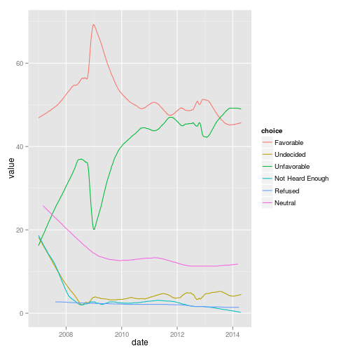

<!--
%\VignetteEngine{knitr}
%\VignetteIndexEntry{Introduction to pollster}
-->


# R interface to the Huffpost Pollster API

This R package is an interface to the Huffington Post [Pollster API](http://elections.huffingtonpost.com/pollster/api), which provides access to opinion polls collected by the Huffington Post.

# Install

Currently this package is **unstable** and may change.

This package is not *yet* on CRAN.

You can install this with the function ``install_github`` in the **devtools** package.

```r
install.packages("devools")
library("devtools")
install_github("jrnold/pollster")
```


```r
library("pollster")
```


# Usage

There are three functions in that provide access to the opinion polls and model estimates from Huffpost Pollster.

- ``pollster_charts``: Get a list of all charts and the current model estimates.
- ``pollster_chart``: Get a single chart along with historical model estimates.
- ``pollster_polls``: Get opinion poll data.

## Charts

To get a list of all the charts in the API use the function ``pollster_charts``,

```r
charts <- pollster_charts()
str(charts)
```

```
#> List of 2
#>  $ charts   :'data.frame':	469 obs. of  8 variables:
#>   ..$ title       : Factor w/ 469 levels "2012 Iowa GOP Primary",..: 1 2 3 4 5 6 7 8 9 10 ...
#>   ..$ slug        : Factor w/ 468 levels "2012-iowa-gop-primary",..: 1 2 3 4 5 6 7 8 9 10 ...
#>   ..$ topic       : Factor w/ 15 levels "2012-gop-primary",..: 1 1 1 1 1 1 1 1 2 3 ...
#>   ..$ state       : Factor w/ 51 levels "IA","NH","SC",..: 1 2 3 4 5 6 7 8 8 8 ...
#>   ..$ short_title : Factor w/ 469 levels "1/3 Iowa Caucus",..: 1 2 3 4 5 6 7 8 9 10 ...
#>   ..$ poll_count  : num [1:469] 65 55 44 59 10 34 19 258 127 589 ...
#>   ..$ last_updated: POSIXct[1:469], format: "2012-01-02 13:08:44" ...
#>   ..$ url         : Factor w/ 468 levels "http://elections.huffingtonpost.com/pollster/2012-iowa-gop-primary",..: 1 2 3 4 5 6 7 8 9 10 ...
#>  $ estimates:'data.frame':	1125 obs. of  8 variables:
#>   ..$ choice         : Factor w/ 320 levels "Romney","Paul",..: 1 2 3 4 5 6 7 8 9 1 ...
#>   ..$ value          : num [1:1125] 22.5 21.3 15.9 12.6 11.1 8.3 3.7 5.9 0.9 39.6 ...
#>   ..$ lead_confidence: num [1:1125] NA NA NA NA NA NA NA NA NA NA ...
#>   ..$ first_name     : chr [1:1125] "Mitt" "Ron" "Rick" "Newt" ...
#>   ..$ last_name      : chr [1:1125] "Romney" "Paul" "Santorum" "Gingrich" ...
#>   ..$ party          : chr [1:1125] "Rep" "Rep" "Rep" "Rep" ...
#>   ..$ incumbent      : logi [1:1125] FALSE FALSE FALSE FALSE FALSE FALSE ...
#>   ..$ slug           : chr [1:1125] "2012-iowa-gop-primary" "2012-iowa-gop-primary" "2012-iowa-gop-primary" "2012-iowa-gop-primary" ...
```

This returns a ``list`` with two data frames.
The data frame ``charts`` has data on each chart,
while the data frame ``estimates`` has the current poll-tracking estimates from each chart.

The query can be filtered by state or topic.
For example, to get only charts related to national topics,

```r
us_charts <- pollster_charts(state = "US")
```


## Chart

To get a particular chart use the function ``pollster_chart``.
For example, to get the chart for [Barack Obama's Favorable Rating](http://elections.huffingtonpost.com/pollster/obama-favorable-rating), specify its *slug*, ``obama-favorable-rating``.

```r
obama_favorable <- pollster_chart('obama-favorable-rating')
str(obama_favorable)
```

```
#> List of 10
#>  $ title            : chr "Barack Obama Favorable Rating"
#>  $ slug             : chr "obama-favorable-rating"
#>  $ topic            : chr ""
#>  $ state            : chr "US"
#>  $ short_title      : chr "Obama Favorability"
#>  $ poll_count       : num 803
#>  $ last_updated     : POSIXct[1:1], format: "2014-04-17 15:48:01"
#>  $ url              : chr "http://elections.huffingtonpost.com/pollster/obama-favorable-rating"
#>  $ estimates        :'data.frame':	4 obs. of  7 variables:
#>   ..$ choice         : Factor w/ 4 levels "Favorable","Unfavorable",..: 1 2 3 4
#>   ..$ value          : num [1:4] 45.9 49 4.2 0.2
#>   ..$ lead_confidence: logi [1:4] NA NA NA NA
#>   ..$ first_name     : logi [1:4] NA NA NA NA
#>   ..$ last_name      : logi [1:4] NA NA NA NA
#>   ..$ party          : logi [1:4] NA NA NA NA
#>   ..$ incumbent      : logi [1:4] NA NA NA NA
#>  $ estimates_by_date:'data.frame':	2120 obs. of  3 variables:
#>   ..$ choice: Factor w/ 6 levels "Undecided","Unfavorable",..: 1 2 3 4 1 2 3 1 2 3 ...
#>   ..$ value : num [1:2120] 4.2 49 45.9 0.2 4.2 49 45.9 4.2 49 45.9 ...
#>   ..$ date  : Date[1:2120], format: "2014-04-15" ...
```

The slug can be found from the results of a ``pollster_charts`` query.
Alternatively the slug is the path of the url of a chart, http://elections.huffingtonpost.com/pollster/obama-favorable-rating.

The historical estimates of the Huffpost Pollster poll-tracking model are contained in the element ``"estimates_by_date"``,

```r
(ggplot(obama_favorable[["estimates_by_date"]], aes(x = date, y = value, color = choice))
 + geom_line())
```

 


## Polls

To get the opinion poll results use the function ``pollster_polls`.
The polls returned can be filtered by topic, chart, state, or date.

By default, ``pollster_polls`` only returns 1 page of results (about 10 polls).
To have it return more polls, increase the value of ``max_pages``.
To have it return all polls, set the value of ``max_pages`` to a very high number.
For example, to return all the polls on the favorability of Bararck Obama after March 1, 2014,

```r
obama_favorable_polls <- pollster_polls(max_pages = 10000, chart = 'obama-favorable-rating', after = "2014-3-1")
str(obama_favorable_polls)	
```

```
#> List of 2
#>  $ polls    :'data.frame':	14 obs. of  9 variables:
#>   ..$ id           : num [1:14] 19256 19261 19252 19239 19169 ...
#>   ..$ pollster     : Factor w/ 8 levels "FOX","YouGov/Economist",..: 1 2 3 2 2 2 4 5 6 2 ...
#>   ..$ start_date   : Date[1:14], format: "2014-04-13" ...
#>   ..$ end_date     : Date[1:14], format: "2014-04-15" ...
#>   ..$ method       : Factor w/ 2 levels "Phone","Internet": 1 2 1 2 2 2 2 1 1 2 ...
#>   ..$ source       : Factor w/ 14 levels "http://www.foxnews.com/politics/interactive/2014/04/16/fox-news-poll-many-voters-say-obama-lies-to-country-on-important-matters"| __truncated__,..: 1 2 3 4 5 6 7 8 9 10 ...
#>   ..$ last_updated : POSIXct[1:14], format: "2014-04-17 14:59:18" ...
#>   ..$ survey_houses: chr [1:14] "" "" "" "" ...
#>   ..$ sponsors     : chr [1:14] "" "" "" "" ...
#>  $ questions:'data.frame':	875 obs. of  14 variables:
#>   ..$ question       : chr [1:875] "Obama Job Approval" "Obama Job Approval" "Obama Job Approval" "Obama Job Approval" ...
#>   ..$ chart          : chr [1:875] "obama-job-approval" "obama-job-approval" "obama-job-approval" "obama-job-approval" ...
#>   ..$ topic          : chr [1:875] "obama-job-approval" "obama-job-approval" "obama-job-approval" "obama-job-approval" ...
#>   ..$ state          : chr [1:875] "US" "US" "US" "US" ...
#>   ..$ subpopulation  : chr [1:875] "Registered Voters" "Registered Voters" "Registered Voters" "Registered Voters - Democrat" ...
#>   ..$ observations   : num [1:875] 1012 1012 1012 395 395 ...
#>   ..$ margin_of_error: num [1:875] 3 3 3 5 5 5 5 5 5 7 ...
#>   ..$ choice         : chr [1:875] "Approve" "Disapprove" "Undecided" "Approve" ...
#>   ..$ value          : num [1:875] 42 51 6 80 13 7 10 85 5 32 ...
#>   ..$ first_name     : chr [1:875] NA NA NA NA ...
#>   ..$ last_name      : chr [1:875] NA NA NA NA ...
#>   ..$ party          : chr [1:875] NA NA NA NA ...
#>   ..$ incumbent      : logi [1:875] NA NA NA NA NA NA ...
#>   ..$ id             : num [1:875] 19256 19256 19256 19256 19256 ...
```


# Example: Obama's Job Approval Rating

This section shows how to use ``pollster`` to create a chart similar to those displayed on the Huffpost Pollster website.
I'll use Obama's job approval rating in this example.

The slug or name of the chart is ``obama-job-approval``, which is derived from the chart's URL , http://elections.huffingtonpost.com/pollster/obama-job-approval.
I'll focus on approval in 2013 in order to reduce the time necessary to run this code.

```r
slug <- "obama-job-approval"
start_date <- as.Date("2013-1-1")
end_date <- as.Date("2014-1-1")
```

For the plot, I'll need both Pollster's model estimates and opinion poll estimates.
I get the Pollster model estimates using ``polster_chart``,

```r
chart <- pollster_chart(slug)
estimates <- chart[["estimates_by_date"]]

estimates <- estimates[estimates$date >= start_date 
                       & estimates$date < end_date, ]
```

and the opinion poll results,

```r
polls <- pollster_polls(chart = slug, 
                        after = start_date, 
                        before = end_date,
                        max_pages = 1000000)
```

Note that in ``polster_poll`` I set the ``max_pages`` argument to a very large number in order to download all the polls available.
This may take several minutes.

Before continuing, we will need to clean up the opinion poll data.
First, only keep results from national subpopulations ("Adults", "Likely Voters", "Registered Voters").
This will drop subpopulations like Republicans, Democrats, and Independents.

```r
questions <-
    subset(polls[["questions"]],
           chart == slug
           & subpopulation %in% c("Adults", "Likely Voters", "Registered Voters"))
```

Second, I will need to recode the choices into three categories, "Approve", "Disapprove", and "Undecided".

```r
approvalcat <- c("Approve" = "Approve",
                 "Disapprove" = "Disapprove",
                 "Undecided" = "Undecided",
                 "Neither" = "Undecided",
                 "Refused" = NA,
                 "Neutral" = "Undecided",
                 "Strongly Approve" = "Approve",
                 "Somewhat Approve" = "Approve", 
                 "Somewhat Disapprove" = "Disapprove",
                 "Strongly Disapprove" = "Disapprove")

questions2 <-
    (questions
     %.% mutate(choice = plyr::revalue(choice, approvalcat))
     %.% group_by(id, subpopulation, choice)
     %.% summarise(value = sum(value)))
```

Now merge the question data with the poll metadata,

```r
polldata <- merge(polls$polls, questions2, by = "id")
```


Now, I can plot the opinion poll results along with the Huffpost Pollster trend estimates,

```r
(ggplot()
 + geom_point(data = polldata,
              mapping = aes(y = value, x = end_date, color = choice),
              alpha = 0.3)
 + geom_line(data = estimates,
             mapping = aes(y = value, x = date, color = choice))
 + scale_x_date("date")
 + scale_color_manual(values = c("Approve" = "black", 
                                 "Disapprove" = "red", 
                                 "Undecided" = "blue"))
 )
```

 

```r

```


# Misc

An earlier R interface to the Pollster API was written by [Drew Linzer](https://github.com/dlinzer/pollstR/).

<!--  LocalWords:  Huffpost API Huffington CRAN github devtools str
 -->
<!--  LocalWords:  devools jrnold ggplot obama url aes favorability
 -->
<!--  LocalWords:  Bararck
 -->
