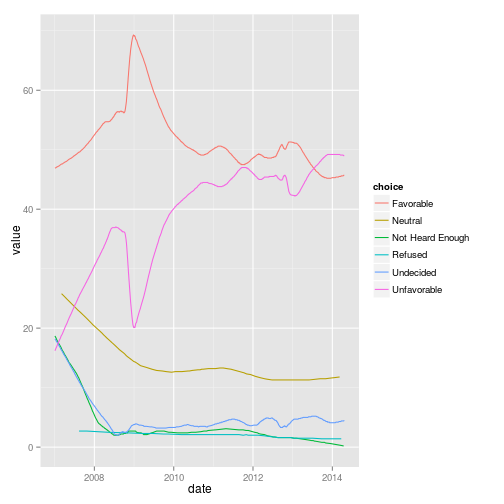
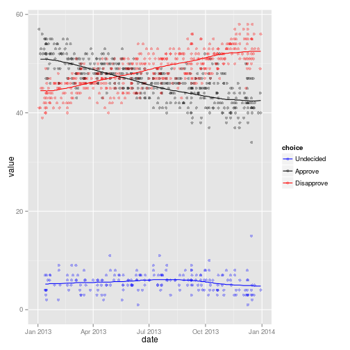

<!--
%\VignetteEngine{knitr::knitr}
%\VignetteIndexEntry{Introduction to pollstR}
-->


# R client for the Huffpost Pollster API

This R package is an interface to the Huffington Post [Pollster API](http://elections.huffingtonpost.com/pollster/api), which provides access to opinion polls collected by the Huffington Post.

The package is released under GPL-2 and the API data it accesses is released under the [Creative Commons Attribution-NonCommercial-ShareAlike 3.0 Unported License](http://creativecommons.org/licenses/by-nc-sa/3.0/deed.en_US).


# API Overview

The Pollster API has two primary data structures: charts and polls.

*Polls* are individual, dated topline results for a single set of candidates in a single race.
The poll data structure consists of (generally) named candidates and percentage support for each, along with additional information (e.g., polling house, sampling frame, sample size, margin of error, state, etc.).

*Charts* aggregate polls for a particular race or topic (e.g., "2012-president" or "obama-job-approval".
A chart reports aggregated survey estimates of support for the candidates in a given race and, possibly, daily estimates of support.
Each chart is named, reports the number of aggregated polls it presents, a last-updated date, and a "slug" field. The "slug" identifies the chart both in the API and on the Pollster website.

In ``pollstR``, there are three functions in that provide access to the opinion polls and model estimates from Huffpost Pollster.

- ``pollstr_charts``: Get a list of all charts and the current model estimates.
- ``pollstr_chart``: Get a single chart along with historical model estimates.
- ``pollstr_polls``: Get opinion poll data.

## Charts

To get a list of all the charts in the API use the function ``pollstr_charts``,

```r
charts <- pollstr_charts()
str(charts)
```

```
#> List of 2
#>  $ charts   :'data.frame':	479 obs. of  9 variables:
#>   ..$ title        : chr [1:479] "2012 Iowa GOP Primary" "2012 New Hampshire GOP Primary" "2012 South Carolina GOP Primary" "2012 Florida GOP Primary" ...
#>   ..$ slug         : chr [1:479] "2012-iowa-gop-primary" "2012-new-hampshire-gop-primary" "2012-south-carolina-gop-primary" "2012-florida-gop-primary" ...
#>   ..$ topic        : chr [1:479] "2012-president-gop-primary" "2012-president-gop-primary" "2012-president-gop-primary" "2012-president-gop-primary" ...
#>   ..$ state        : chr [1:479] "IA" "NH" "SC" "FL" ...
#>   ..$ short_title  : chr [1:479] "1/3 Iowa Caucus" "1/10 New Hampshire Primary" "1/21 South Carolina Primary" "1/31 Florida Primary" ...
#>   ..$ election_date: Date[1:479], format: NA ...
#>   ..$ poll_count   : num [1:479] 65 55 44 59 10 34 19 258 589 300 ...
#>   ..$ last_updated : POSIXct[1:479], format: "2012-01-02 13:08:44" ...
#>   ..$ url          : chr [1:479] "http://elections.huffingtonpost.com/pollster/2012-iowa-gop-primary" "http://elections.huffingtonpost.com/pollster/2012-new-hampshire-gop-primary" "http://elections.huffingtonpost.com/pollster/2012-south-carolina-gop-primary" "http://elections.huffingtonpost.com/pollster/2012-florida-gop-primary" ...
#>  $ estimates:'data.frame':	1137 obs. of  8 variables:
#>   ..$ choice         : chr [1:1137] "Romney" "Paul" "Santorum" "Gingrich" ...
#>   ..$ value          : num [1:1137] 22.5 21.3 15.9 12.6 11.1 8.3 3.7 5.9 0.9 39.6 ...
#>   ..$ lead_confidence: num [1:1137] NA NA NA NA NA NA NA NA NA NA ...
#>   ..$ first_name     : chr [1:1137] "Mitt" "Ron" "Rick" "Newt" ...
#>   ..$ last_name      : chr [1:1137] "Romney" "Paul" "Santorum" "Gingrich" ...
#>   ..$ party          : chr [1:1137] "Rep" "Rep" "Rep" "Rep" ...
#>   ..$ incumbent      : logi [1:1137] FALSE FALSE FALSE FALSE FALSE FALSE ...
#>   ..$ slug           : chr [1:1137] "2012-iowa-gop-primary" "2012-iowa-gop-primary" "2012-iowa-gop-primary" "2012-iowa-gop-primary" ...
#>  - attr(*, "class")= chr "pollstr_charts"
```
This returns a ``list`` with two data frames.
The data frame ``charts`` has data on each chart,
while the data frame ``estimates`` has the current poll-tracking estimates from each chart.

The query can be filtered by state or topic.
For example, to get only charts related to national topics,

```r
us_charts <- pollstr_charts(state = "US")
```

## Chart

To get a particular chart use the function ``pollstr_chart``.
For example, to get the chart for [Barack Obama's Favorable Rating](http://elections.huffingtonpost.com/pollster/obama-favorable-rating), specify its *slug*, ``obama-favorable-rating``.

```r
obama_favorable <- pollstr_chart('obama-favorable-rating')
print(obama_favorable)
```

```
#> Title:       Barack Obama Favorable Rating 
#> Chart Slug:  obama-favorable-rating 
#> Topic:       favorable-ratings 
#> State:       US 
#> Polls:       828 
#> Updated:     1.408e+09 
#> URL:         http://elections.huffingtonpost.com/pollster/obama-favorable-rating 
#> Estimates:
#>        choice value lead_confidence first_name last_name party incumbent
#> 1   Favorable  45.2              NA         NA        NA    NA        NA
#> 2 Unfavorable  49.8              NA         NA        NA    NA        NA
#> 3   Undecided   3.8              NA         NA        NA    NA        NA
#> 4     Neutral  13.3              NA         NA        NA    NA        NA
#> 
#> First 6 (of 2188) daily estimates:
#>        choice value       date
#> 1   Favorable  45.2 2014-08-07
#> 2   Undecided   3.8 2014-08-07
#> 3 Unfavorable  49.8 2014-08-07
#> 4   Favorable  45.2 2014-08-04
#> 5   Undecided   3.8 2014-08-04
#> 6 Unfavorable  49.7 2014-08-04
```
The slug can be found from the results of a ``pollstr_charts`` query.
Alternatively the slug is the path of the url of a chart, http://elections.huffingtonpost.com/pollster/obama-favorable-rating.

The historical estimates of the Huffpost Pollster poll-tracking model are contained in the element ``"estimates_by_date"``,

```r
(ggplot(obama_favorable[["estimates_by_date"]], aes(x = date, y = value, color = choice))
 + geom_line())
```

 

## Polls

To get the opinion poll results use the function ``pollstr_polls`.
The polls returned can be filtered by topic, chart, state, or date.

By default, ``pollstr_polls`` only returns 1 page of results (about 10 polls).
To have it return more polls, increase the value of ``max_pages``.
To have it return all polls, set the value of ``max_pages`` to a very high number.
For example, to return all the polls on the favorability of Bararck Obama after March 1, 2014,

```r
obama_favorable_polls <- pollstr_polls(max_pages = 10000, chart = 'obama-favorable-rating', after = "2014-3-1")
str(obama_favorable_polls)	
```

```
#> List of 4
#>  $ polls        :'data.frame':	39 obs. of  9 variables:
#>   ..$ id          : int [1:39] 20095 20060 20051 20005 20024 19908 19867 19866 19819 19801 ...
#>   ..$ pollster    : chr [1:39] "McClatchy/Marist" "YouGov/Economist" "NBC/WSJ" "YouGov/Economist" ...
#>   ..$ start_date  : Date[1:39], format: "2014-08-04" ...
#>   ..$ end_date    : Date[1:39], format: "2014-08-07" ...
#>   ..$ method      : chr [1:39] "Phone" "Internet" "Phone" "Internet" ...
#>   ..$ source      : chr [1:39] "https://s3.amazonaws.com/s3.documentcloud.org/documents/1273166/mcclatchy-marist-poll-obama-and-congress-august.pdf" "http://d25d2506sfb94s.cloudfront.net/cumulus_uploads/document/4p77753nxv/econToplines.pdf" "http://msnbcmedia.msn.com/i/MSNBC/Sections/A_Politics/14643%20AUGUST%20NBC-WSJ%20POLL.pdf" "http://d25d2506sfb94s.cloudfront.net/cumulus_uploads/document/zfxv8cg1n7/econToplines.pdf" ...
#>   ..$ last_updated: POSIXct[1:39], format: "2014-08-12 14:26:39" ...
#>   ..$ partisan    : chr [1:39] "Nonpartisan" "Nonpartisan" "Nonpartisan" "Nonpartisan" ...
#>   ..$ affiliation : chr [1:39] "None" "None" "None" "None" ...
#>  $ questions    :'data.frame':	2724 obs. of  14 variables:
#>   ..$ question       : chr [1:2724] "2014 National House Race" "2014 National House Race" "2014 National House Race" "2014 National House Race" ...
#>   ..$ chart          : chr [1:2724] "2014-national-house-race" "2014-national-house-race" "2014-national-house-race" "2014-national-house-race" ...
#>   ..$ topic          : chr [1:2724] "2014-house" "2014-house" "2014-house" "2014-house" ...
#>   ..$ state          : chr [1:2724] "US" "US" "US" "US" ...
#>   ..$ subpopulation  : chr [1:2724] "Registered Voters" "Registered Voters" "Registered Voters" "Registered Voters" ...
#>   ..$ observations   : int [1:2724] 806 806 806 806 806 806 806 NA NA NA ...
#>   ..$ margin_of_error: num [1:2724] 3.5 3.5 3.5 3.5 3.5 3.5 3.5 NA NA NA ...
#>   ..$ choice         : chr [1:2724] "Democrat" "Republican" "Neither" "Undecided" ...
#>   ..$ value          : num [1:2724] 38 43 6 12 40 52 8 80 14 6 ...
#>   ..$ first_name     : chr [1:2724] NA NA NA NA ...
#>   ..$ last_name      : chr [1:2724] NA NA NA NA ...
#>   ..$ party          : chr [1:2724] "Dem" "Rep" NA NA ...
#>   ..$ incumbent      : logi [1:2724] FALSE FALSE NA NA NA NA ...
#>   ..$ id             : int [1:2724] 20095 20095 20095 20095 20095 20095 20095 20095 20095 20095 ...
#>  $ survey_houses:'data.frame':	48 obs. of  3 variables:
#>   ..$ name : chr [1:48] "Marist College" "YouGov" "Peter Hart (D)" "Bill McInturff (R)" ...
#>   ..$ party: chr [1:48] "N/A" "N/A" "Dem" "Rep" ...
#>   ..$ id   : num [1:48] 20095 20060 20051 20051 20005 ...
#>  $ sponsors     :'data.frame':	43 obs. of  3 variables:
#>   ..$ name : chr [1:43] "McClatchy Newspapers" "Economist" "NBC News" "Wall Street Journal" ...
#>   ..$ party: chr [1:43] "N/A" "N/A" "N/A" "N/A" ...
#>   ..$ id   : num [1:43] 20095 20060 20051 20051 20005 ...
#>  - attr(*, "class")= chr "pollstr_polls"
```


# Example: Obama's Job Approval Rating

This section shows how to use ``pollstr`` to create a chart similar to those displayed on the Huffpost Pollster website.
I'll use Obama's job approval rating in this example.

The slug or name of the chart is ``obama-job-approval``, which is derived from the chart's URL , http://elections.huffingtonpost.com/pollster/obama-job-approval.
I'll focus on approval in 2013 in order to reduce the time necessary to run this code.

```r
slug <- "obama-job-approval"
start_date <- as.Date("2013-1-1")
end_date <- as.Date("2014-1-1")
```
For the plot, I'll need both Pollster's model estimates and opinion poll estimates.
I get the Pollster model estimates using ``polster_chart``,

```r
chart <- pollstr_chart(slug)
estimates <- chart[["estimates_by_date"]]

estimates <- estimates[estimates$date >= start_date 
                       & estimates$date < end_date, ]
```
and the opinion poll results,

```r
polls <- pollstr_polls(chart = slug, 
                        after = start_date, 
                        before = end_date,
                        max_pages = 1000000)
```
Note that in ``polster_poll`` I set the ``max_pages`` argument to a very large number in order to download all the polls available.
This may take several minutes.

Before continuing, we will need to clean up the opinion poll data.
First, only keep results from national subpopulations ("Adults", "Likely Voters", "Registered Voters").
This will drop subpopulations like Republicans, Democrats, and Independents.

```r
questions <-
    subset(polls[["questions"]],
           chart == slug
           & subpopulation %in% c("Adults", "Likely Voters", "Registered Voters"))
```
Second, I will need to recode the choices into three categories, "Approve", "Disapprove", and "Undecided".

```r
approvalcat <- c("Approve" = "Approve",
                 "Disapprove" = "Disapprove",
                 "Undecided" = "Undecided",
                 "Neither" = "Undecided",
                 "Refused" = NA,
                 "Neutral" = "Undecided",
                 "Strongly Approve" = "Approve",
                 "Somewhat Approve" = "Approve", 
                 "Somewhat Disapprove" = "Disapprove",
                 "Strongly Disapprove" = "Disapprove")

questions2 <-
    (questions
     %.% mutate(choice = plyr::revalue(choice, approvalcat))
     %.% group_by(id, subpopulation, choice)
     %.% summarise(value = sum(value)))
```
Now merge the question data with the poll metadata,

```r
polldata <- merge(polls$polls, questions2, by = "id")
```

Now, I can plot the opinion poll results along with the Huffpost Pollster trend estimates,

```r
(ggplot()
 + geom_point(data = polldata,
              mapping = aes(y = value, x = end_date, color = choice),
              alpha = 0.3)
 + geom_line(data = estimates,
             mapping = aes(y = value, x = date, color = choice))
 + scale_x_date("date")
 + scale_color_manual(values = c("Approve" = "black", 
                                 "Disapprove" = "red", 
                                 "Undecided" = "blue"))
 )
```

 

<!--  LocalWords:  Huffpost API Huffington CRAN github devtools str
 -->
<!--  LocalWords:  devools jrnold ggplot obama url aes favorability
 -->
<!--  LocalWords:  Bararck
 -->

<!--  LocalWords:  Huffpost API Huffington CRAN github devtools str
 -->
<!--  LocalWords:  devools jrnold ggplot obama url aes favorability
 -->
<!--  LocalWords:  Bararck
 -->
